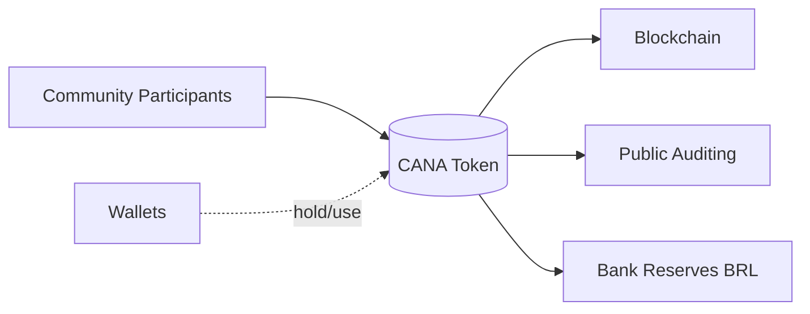
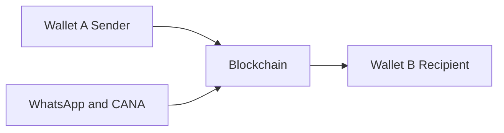

# Onchain Community Currency Monorepo

(A) Community participants mint/redeem (B) Caiana tokens backed by BRL reserves held at (D) the bank. Activity is recorded on the blockchain and can be inspected (C) for transparency. Users hold and use tokens in (E) wallets.

- A: Sender wallet
- B: Recipient wallet
- C: WhatsApp interface and on-chain token actions via the backend
- Blockchain: records token transfers between wallets

This repository contains the code and configuration for Caiana — a community currency system built on Celo — and supporting tooling to launch, operate, and document a bank‑backed, on‑chain local currency.

**Tech Stack Flow**
- Entry points
  - WhatsApp webhook → `communitycurrencylauncher/api/twilio/whatsapp.js` (Vercel Function)
  - Static frontend (approval + ops) → `communitycurrencylauncher/public/*` served by Vercel
- Chat orchestration
  - Core logic → `communitycurrencylauncher/services/whatsappService.js`
  - Stores only non‑sensitive data (sessions, phone→public address mapping) via `DATABASE_URL`; never stores private keys
- Wallets and custody
  - Self‑custodial users link a wallet; no keys are stored server‑side
  - One‑time allowance approval: user approves an operator address once per token in‑app
    - Page → `communitycurrencylauncher/public/approve-operator.html`
    - Finds token by name/symbol (scans factory deployments) or accepts direct address
- Sponsored sending (ERC‑4337)
  - Operator uses a Smart Account (AA) with Pimlico bundler + paymaster on Celo mainnet for gas sponsorship
  - If available, AA address is used as spender; otherwise, fallback to EOA operator (env‑only `PRIVATE_KEY`)
  - Only tokens deployed by your `FACTORY_ADDRESS` are sponsored
- Bank linkage and auto‑mint
  - Pluggy integration → `communitycurrencylauncher/services/pluggyService.js`
  - Connect bank (`/api/connect-bank/:tokenAddress`), link PIX keys, and auto‑mint on inbound deposits
  - Per‑token oracle updates backing balances on‑chain
- Contracts
  - TokenFactory deploys BankBackedToken + per‑token BankOracle → `communitycurrencylauncher/contracts/*.sol`
  - Extended factory flow can pre‑authorize oracle updaters and link initial accounts
- API surface (Vercel Functions under `communitycurrencylauncher/api/`)
  - `health.js` — liveness
  - `deploy-token.js` — deploy a new community token (via factory)
  - `connect-bank/[tokenAddress].js` — start Pluggy Connect for a token
  - `pix/link.js` — link PIX key → wallet for auto‑mint
  - `tokens/[address]/redeem.js` — redemption flow hook
  - `whatsapp/*` — link/register via chat helpers
  - `webhooks/pluggy.js` — receive Pluggy updates

**End‑To‑End Flows**
- Onboarding
  - User messages WhatsApp → webhook validates Twilio → hands to `whatsappService`
  - User links wallet (public address only) → receives one‑time approval link
  - Approve page uses ethers/WalletConnect to approve operator/AA for a chosen token
- Send (after approval)
  - User types “send 10 …” in chat; service checks balance/allowance
  - If token is from factory and AA is active, submits sponsored transferFrom via Pimlico; else uses EOA operator
  - Recipient receives WhatsApp confirmation with tx hash
- Bank connect and auto‑mint
  - Admin deploys token (factory creates per‑token oracle)
  - Bank connection via Pluggy → oracle linked → balances updated → auto‑mint path transfers backed tokens
- Redemption
  - User transfers tokens to redemption wallet (admin) → backend pays PIX and burns tokens via oracle rules

**Environments & Secrets**
- Vercel Project → Environment Variables (no `.env` stored in repo)
- Required (examples)
  - WhatsApp: `ACCOUNT_SID`, `AUTH_TOKEN`, `PHONE_NUMBER`
  - Blockchain: `RPC_ENDPOINT` (Celo), `FACTORY_ADDRESS`, `PRIVATE_KEY`
  - Pimlico AA: `PIMLICO_API_KEY` (bundler + paymaster sponsorship)
  - Pluggy: `PLUGGY_CLIENT_ID`, `PLUGGY_CLIENT_SECRET`
  - Database: `DATABASE_URL` (Postgres; non‑sensitive state only)
- Frontend public config → `communitycurrencylauncher/public/env.js`
  - `window.CELO_FACTORY_ADDRESS`, `window.WC_PROJECT_ID`, optional explorer links

**Security Model**
- No private keys persisted in the database or repo
- Operator key (EOA) and AA signer loaded only from environment
- Sponsored sends limited to tokens deployed by your factory address
- Users can revoke allowance anytime at the token contract

## What’s Inside

- `frontend/` — Web UI for interacting with the system (if present in your checkout).
- `backend/` — Lightweight backend (Node/Express) with endpoints for auth, admin config, and on-chain utilities.
- `stablecoin/` — Caiana (CANA) stablecoin contracts and tooling (based on Circle’s stablecoin-evm framework). Includes Hardhat/Foundry config, deployment scripts, and docs.
- `communitycurrencylauncher/` — A launcher app to create and manage community currencies, including contracts, backend helpers, and a static frontend.

## Public Links

- Caiana public statement and on‑chain activity (Blockscout):
  https://celo.blockscout.com/address/0x15ffACd88539aFa123AD4707e28f6Bc3A7DBBad7?tab=txs
- Community Currency Launcher (live):
  https://brazil-community-currency.vercel.app/

## Transparency

The amount of Caiana (CANA) minted corresponds to BRL reserves and is evidenced publicly via the Blockscout link above. See `stablecoin/README.md` for details.

## Production UX

In a production setting, people would transact on Web3 with the community currency via WhatsApp or the community’s already established application. The blockchain/Web3 layer is abstracted behind the scenes, so users can send and receive value without needing to know it is Web3.

## Future Improvements

- Paymaster (Pimlico on Celo) for sponsored, free end-user transactions.
- Public transparency portal: an easy-to-read web frontend for the general public showing live BRL reserves, circulating CANA supply, and recent changes (with charts), sourced from bank attestations and on-chain data.
  - Example: https://bancodacidade.com/transparencia-banco-de-aracoiaba/ — a model that would be great to update dynamically with live data.
- Geofenced boundaries that only allow transactions within the community’s defined area.
- Holder cap: at most 10,000 wallet addresses can hold the community currency.
- Governance interfaces, potentially coordinated through WhatsApp.
- NFT-linked compliance docs: Publish and reference required CADSOL/DCSOL/MTE-Senaes documentation via an NFT bound to the community currency, enabling public, tamper-evident verification of regulatory materials and versioning.

### Regulatory Context (Brazil, 2025)

In 2025, under PL 4476/2023 and the CADSOL framework, any organization issuing or managing a community currency (Moeda Social) in Brazil must register as a solidarity economy enterprise through CADSOL, providing founding and governance documents, member lists, and proof of community activity. After receiving the DCSOL certificate, it must obtain MTE/Senaes authorization, submitting its statute, proof of Real-backed reserves (1:1 parity), a territorial and transparency plan, and technology compliance (for blockchain/DLT systems). Renewal every two years and periodic audits ensure reserve integrity and ongoing community participation within Brazil’s solidarity economy system.

Planned enhancement: identify and attest these documents on-chain through an NFT linked to the community currency for public discoverability and proof of provenance.

## Development Overview

- Prereqs typically include Node.js (LTS), pnpm/yarn/npm, and for contracts Hardhat/Foundry. See subproject READMEs for exact versions and steps.
- Common workflows:
  - Frontend: install, build, and run dev server.
  - Backend: provide `.env` (see examples), then run with Node.
  - Contracts: build/test with Foundry or Hardhat; deploy via provided scripts.

## Security and Secrets

- Do not commit private keys or secrets. Environment files are ignored by `.gitignore` and examples are provided as `.env.example` where applicable.
- If rotating or revoking credentials, update deployment configs and relevant services.

## Repository Structure Notes

- Each subfolder contains its own README and scripts where applicable.
- This repo tracks both application code (UI/API) and on‑chain components for a cohesive, auditable system.
